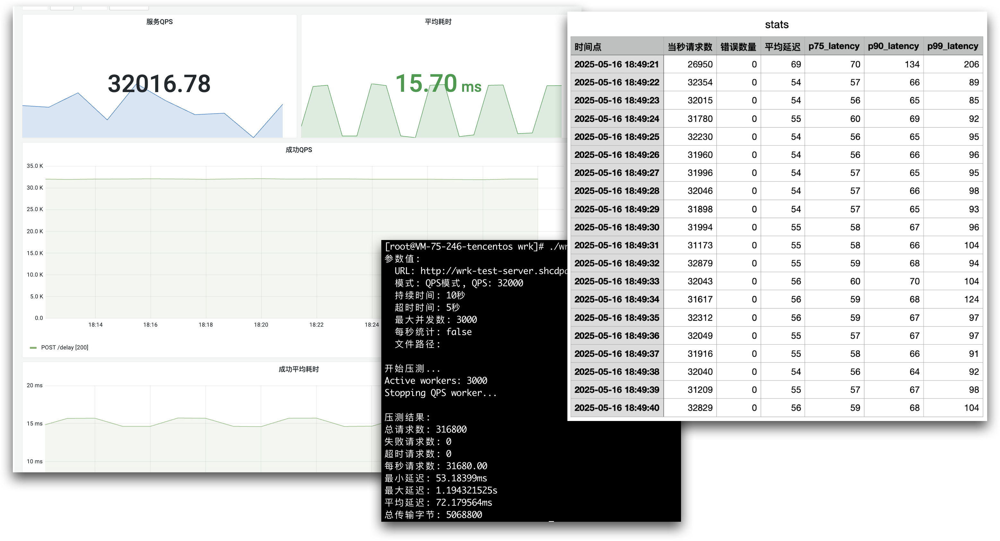
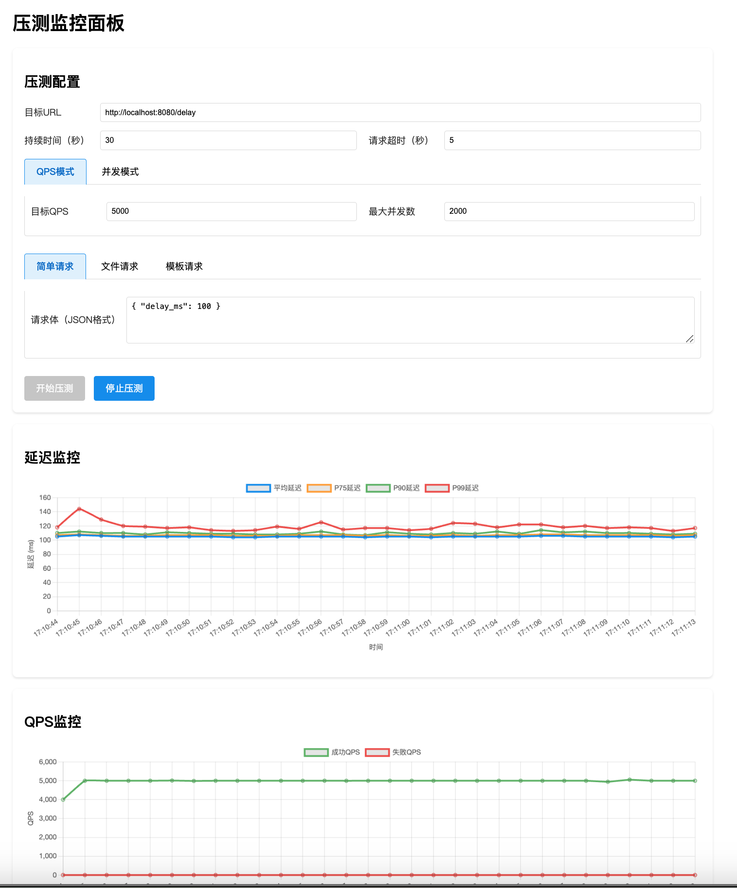

# HTTP 压测工具

这是一个简单的 HTTP 压测工具，用于于 HTTP POST 请求的测试。
它支持两种压测模式：**固定并发模式**和 **固定QPS 模式**。支持按照秒级统计请求延迟和 QPS。



## 特性

- 支持并发模式和 QPS 模式
- 请求延迟统计（最小、最大、平均）
- QPS（每秒查询数、耗时分位数等）按秒统计
- 失败请求计数，落本地日志（TODO）
- 超时请求计数
- 总传输字节统计
- 可自定义测试持续时间
- 可自定义请求超时时间
- QPS 模式下的并发数限制
- 支持从文件读取请求体
- 支持从CSV文件生成请求体（使用模板）
- 支持WEB UI页面

## 代码组织

wrk 目录为工具的代码目录，分为以下主要文件：

- `main.go`: 包含参数处理，启动压测
- `worker.go`: 包含主要的压测逻辑，管理 HTTP 客户端和请求处理
- `stat.go`: 统计信息收集和报告
- `generator.go`: 包含请求生成相关的代码
    - `RequestGenerator` 接口：定义请求生成的标准接口
    - `SimpleRequestGenerator`: 生成简单测试请求
    - `CustomRequestGenerator`: 使用预定义请求列表的生成器
- `file_generator.go`: 从文件读取请求体的生成器
- `tpl_generator.go`: 从CSV文件生成请求体的生成器
- `client_pool.go`: HTTP 客户端连接池管理
- `dns_cache.go`: DNS 缓存实现

## 编译

```bash
go build -o wrk ./wrk
```

## 使用方法

```bash
./wrk [选项]
```

### 命令行参数

#### 压测模式参数（二选一）
- `--concurrency`: 并发数（与 qps 互斥）
- `--qps`: 每秒请求数（与 concurrency 互斥）
- `--max-workers`: QPS 模式下的最大并发数（默认：2000）

#### 通用参数
- `--url`: 测试目标URL（默认：http://localhost:8080/delay）
- `--duration`: 测试持续时间，单位秒（默认：30）
- `--timeout`: 请求超时时间，单位秒（默认：5）
- `--enable-second-stats`: 是否记录每秒的统计信息（不需要指定值，使用该参数即表示启用）

#### 请求来源参数（三选一）
- `--request`: 直接指定请求体字符串。使用此选项时，`--file` 和 `--req-template` 必须为空
- `--file`: 输入文件路径，如果指定则使用文件内容作为请求体
- `--req-template`: 请求模板，用于从CSV文件生成请求体。使用此选项时必须同时指定 `--file` 参数，且文件必须是CSV格式

### 参数使用说明

#### 压测模式选择

1. 并发模式：
```bash
./wrk --url http://localhost:8080/api --concurrency 100 --duration 30
```

2. QPS模式：
```bash
./wrk --url http://localhost:8080/api --qps 100 --duration 30
```

#### 请求来源选择

1. 使用固定请求体：
```bash
./wrk --url http://localhost:8080/api --request '{"key": "value"}' --qps 100
```

2. 使用文件内容：
```bash
./wrk --url http://localhost:8080/api --file requests.txt --qps 100
```

3. 使用CSV文件和模板：
```bash
./wrk --url http://localhost:8080/api \
      --file data.csv \
      --req-template '{"name": "${name}", "age": "${age}", "city": "${city}"}' \
      --qps 100
```

### 注意事项

1. 压测模式相关：
   - 并发模式和QPS模式不能同时使用
   - 必须指定并发数或QPS中的一个
   - QPS模式下必须指定大于0的max-workers参数

2. 请求来源相关：
   - 使用 `--request` 时，`--file` 和 `--req-template` 必须为空
   - 使用 `--req-template` 时：
     - 必须同时指定 `--file` 参数
     - 文件必须是CSV格式（.csv后缀）
     - CSV文件的第一行必须是表头
     - 模板中使用的所有变量名必须在CSV表头中存在
     - CSV文件的每一行数据列数必须与表头列数相同

### 压测模式

1. 并发模式
    - 使用 `--concurrency` 参数指定并发数
    - 适合测试服务器在固定并发下的性能
    - 示例：`./wrk --concurrency 100 --duration 30`

2. QPS 模式
    - 使用 `--qps` 参数指定每秒请求数
    - 适合测试服务器在固定请求频率下的性能
    - 通过 `--max-workers` 参数控制最大并发数，防止协程数量过多
    - 示例：`./wrk --qps 1000 --duration 30 --max-workers 200`


### 输出说明

工具会输出以下统计信息：

- 总请求数
- 失败请求数
- 超时请求数
- 每秒请求数（QPS）
- 最小延迟
- 最大延迟
- 平均延迟
- 总传输字节

当启用 `--enable-second-stats` 时，会生成 stats.csv 文件，包含以下信息：

- 时间点
- 当秒请求数
- 错误数量
- 平均延迟
- P75 延迟
- P90 延迟
- P99 延迟

### 示例输出

```
开始压测 http://localhost:8080/delay
QPS: 1000, 持续时间: 30秒
最大并发数: 200
请求超时: 5秒

压测结果:
总请求数: 30000
失败请求数: 0
超时请求数: 0
每秒请求数: 1000.00
最小延迟: 50ms
最大延迟: 200ms
平均延迟: 125ms
总传输字节: 1200000
``` 


## UI 的使用

可以直接启动 Web UI 服务，通过页面进行压力测试，能够清晰的展示压测结果。

启动方法：

```bash
cd ui && python app.py
```

浏览器访问<http://127.0.0.1:8081/> 即可开始压测：


